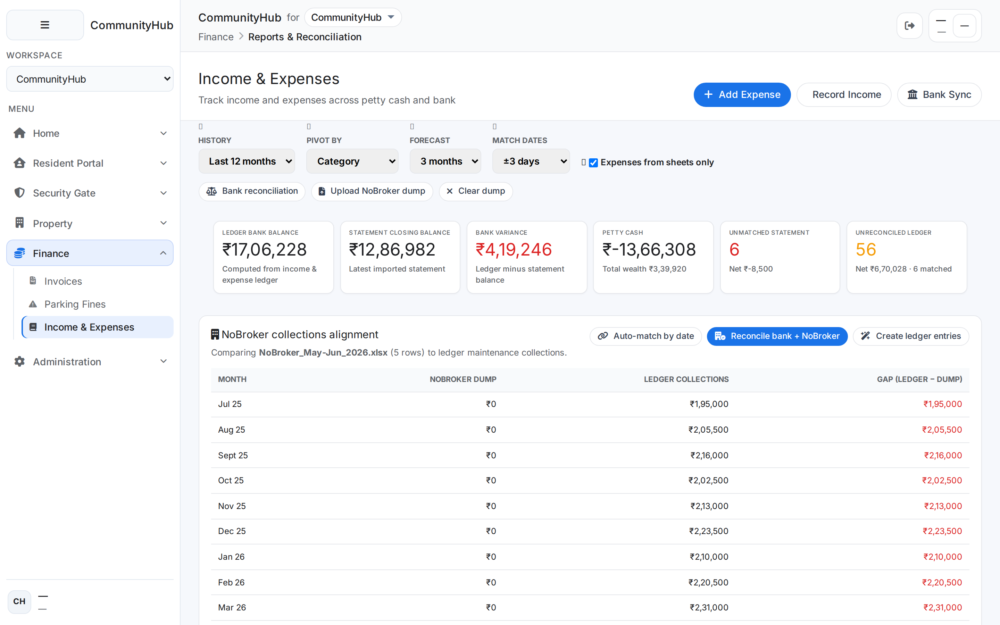
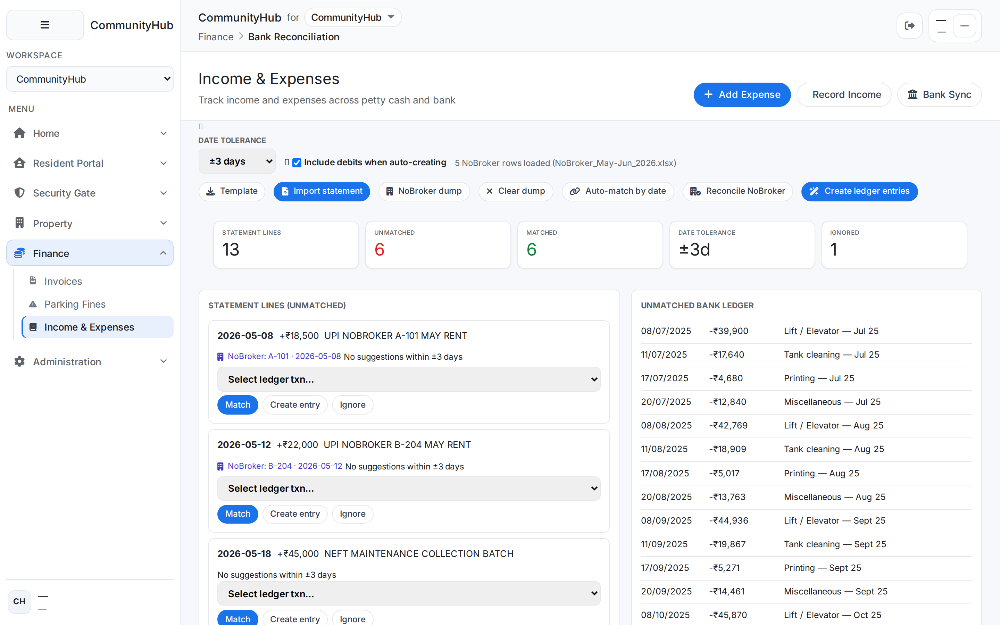

# Finance Reports & Bank Reconciliation — UI Preview

Mock data: **Green Valley Apartments** (12 months ledger, bank statement, NoBroker dump).

## Reports & Reconciliation



- Balance reconciliation (ledger vs statement closing balance)
- NoBroker monthly alignment table
- Income/expense trend chart with 3-month projection
- Expense pivot from synced expense sheets

## Bank Reconciliation



- Unmatched statement lines with NoBroker hints
- Auto-match, Reconcile NoBroker, Create ledger entries
- Unmatched bank ledger panel

## Regenerate screenshots

```bash
npm install
node scripts/capture-finance-screenshots.mjs
cp /opt/cursor/artifacts/screenshots/*.png docs/screenshots/
```
